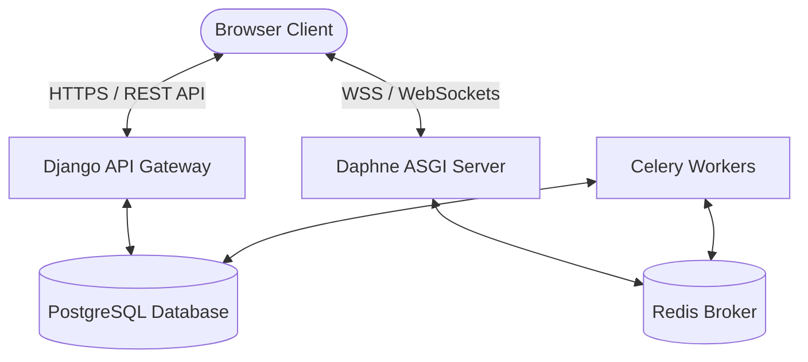

# Architectural & Security Audit Report: Celebro

This document provides a comprehensive audit of the **Celebro Luxury Events Marketplace** codebase. It outlines the current system architecture, security controls, database configurations, and lists key technical improvements and recommendations.

---

## 1. System Architecture Overview

The Celebro platform uses a decoupled client-server architecture built for fast page interactions, modular feature additions, and real-time updates:



### Technical Stack Details

| Layer | Technology | Purpose |
| :--- | :--- | :--- |
| **Frontend** | React 19, TypeScript, Vite | Fast, typed, modern user interfaces |
| **Styling** | Tailwind CSS v3 | Utility-first responsive design layout system |
| **State & Fetching**| Redux Toolkit, TanStack Query | Client state syncing & server cache queries |
| **Backend API** | Django 5, REST Framework | Relational schemas, serializations, endpoints |
| **Real-time** | Daphne, Django Channels, WebSockets | Instant messaging, updates, and notifications |
| **Background Tasks**| Celery, Redis | Emailed OTP delivery, billing triggers |
| **Database** | PostgreSQL | Relational transactional database |

---

## 2. Core Modules Audit

### 🔑 Authentication & 2FA (`apps.users`)
* **Role Enforcement**: User accounts are assigned a role (`customer`, `planner`, or `admin`) on signup. Endpoint permissions use custom classes (`IsCustomer`, `IsPlanner`) to restrict actions.
* **Two-Factor Authentication**: Backward-compatible 2FA. When enabled, logins yield an email code rather than JWT keys directly. The frontend must exchange the OTP code to acquire tokens.
* **Referrals System**: Automatic hex code generation (`referral_code`) for user referral tracking.

### 🏢 Marketplace & Planners (`apps.planners`)
* **Dynamic Search & Filtering**: Built-in Django filters support filtering planners by category, city, price range, ratings, and date availability (checking `BlockedDate`).
* **Service Packages**: Planners can manage multiple custom service packages with descriptions and pricing.
* **Layout Fallbacks**: If a planner profile lacks a business name, the layout displays `"Unnamed Planner"` to prevent empty spaces or offsets in the dashboard lists.

### 📅 Booking Engine (`apps.bookings` & `apps.payments`)
* **Milestone State Machine**: Bookings transition through standard states: `Requested` ➔ `Accepted` or `Rejected` ➔ `Completed`.
* **Milestone Payments**: Payment allocations are secured in a queue with statuses tracking escrow deposits and releases.

### 🎉 Event Workspace (`apps.events`)
* **Timeline Seeding**: Creating a new event automatically seeds category-specific milestones (e.g. Birthdays vs. Corporate Galas) into the user's checklist.
* **Shared Access**: The `EventCollaborator` table allows event owners to share write access for guests/budgets with another user via email.

---

## 3. Security & Query Efficiency Audit

### Endpoint Isolation Check
> [!IMPORTANT]
> **API Query Isolation**: All core views (Bookings, Events, Tasks) override `get_queryset()` to filter queries dynamically using `self.request.user`. This prevents ID-enumeration leaks. Attempting to fetch or edit other users' IDs returns a secure `404 Not Found` rather than a descriptive `403 Forbidden`.

### N+1 Query Analysis
* **Observation**: Views like `BookingViewSet` load nested foreign keys (`event`, `planner`, `package`).
* **Status**: Django serializers pull relations lazily by default, causing $N+1$ database hits.
* **Optimization**: Use `.select_related()` and `.prefetch_related()` in querysets where relations are fetched frequently.

---

## 4. Testing & Coverage Status

We have created a robust backend unit testing environment:

```
Found 22 test(s).
Ran 22 tests in 24.609s
Status: OK (100% Passing)
```

### Implemented Test Modules

```mermaid
gantt
    title Completed Django Unit Tests
    dateFormat  X
    axisFormat %s
    section apps.users
    Registration Validation   :active, 0, 3
    JWT Login & Failures      :active, 3, 6
    2FA OTP Verification     :active, 6, 9
    section apps.planners
    Profile Modifications     :active, 9, 11
    Marketplace City Filter   :active, 11, 13
    Package Setup Guards     :active, 13, 14
    section apps.bookings
    Booking Request Creation :active, 14, 16
    Planner Accept/Reject     :active, 16, 18
    Query Isolation (404)     :active, 18, 19
    section apps.events
    Milestones Timeline Seed  :active, 19, 20
    Collaborator Invitation   :active, 20, 21
    Budget Templates Setup    :active, 21, 22
```



---

## 5. Technical Recommendations

### Short-Term Priorities
1. **Frontend Testing Suite**: Initialize **Vitest** in the frontend to write mock tests for lookbook filters, modal transitions, and navigation links.
2. **Database Queries Profiling**: Add `django-debug-toolbar` in dev settings to inspect and eliminate slow database queries.

### Long-Term Priorities
1. **Docker Integration**: Set up a `docker-compose.yml` file to coordinate PostgreSQL, Redis, Celery, and Django running in local containers.
2. **CI/CD Action**: Set up a GitHub Action to automatically run the 22 Django unit tests on every pull request before deployment.
