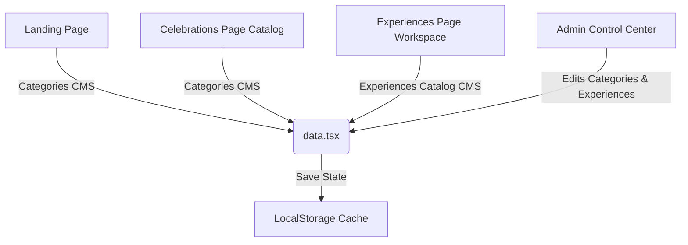

# Celebro — Premium Event Platform Upgrade Walkthrough

This document outlines the core architectural upgrades, catalog interfaces, administrative settings, and access control capabilities implemented to elevate Celebro into a high-end celebration catalog platform.

---

## 🏗️ Core Architectural Upgrades

Celebro's layout features have been decoupled so that pages are no longer simple duplicates of the landing page selector, but instead function as dedicated catalogs with localized data layers.

### 1. Unified LocalStorage CMS Data Layer ([data.tsx](file:///c:/Users/welcome/Downloads/celebro_fixed/frontend/src/features/landing/data.tsx))
*   **Categories Cache**: Centralized category metadata is stored under cache version `celebro_cms_categories_v2` to ensure dynamic updates.
*   **Experiences Cache**: Detailed experience programs (itineraries, amenities lists, taglines, locations) are managed under `celebro_cms_experiences_catalog`.
*   **INR Conversion**: Swapped default package pricing structures globally from USD (`$`) to INR (`₹`).

### 3. Navigation Update
*   Modified [`LandingNav.tsx`](file:///c:/Users/welcome/Downloads/celebro_fixed/frontend/src/features/landing/LandingNav.tsx) to:
    *   Merge the separate "Celebrations" and "Experiences" links into a single navigation item labeled **"Experiences"** pointing to `/experiences`.
    *   Dynamically render a **"Sign out"** option alongside the **"Dashboard"** button on both desktop and mobile layouts when a user is logged in. This clears the session (`localStorage`) and seamlessly brings them back to the sign-in/register screen.

### 4. Premium Dashboard UI/UX Design System Alignment
*   Modified [`WidgetCard.tsx`](file:///c:/Users/welcome/Downloads/celebro_fixed/frontend/src/components/ui/WidgetCard.tsx) to use the project's exact custom styles (`border-softborder`, `text-txtprimary`, and `shadow-soft`) instead of mismatched brown-gray values.
*   Modified [`CelebratorDashboardPage.tsx`](file:///c:/Users/welcome/Downloads/celebro_fixed/frontend/src/features/dashboard/CelebratorDashboardPage.tsx) to completely revamp the visual style of the customer dashboard:
    *   **Welcome Hero**: Replaced generic Tailwind gradients with the project's premium brand gradient (`from-[#3B176D] via-[#5B21B6] to-[#8B5CF6]`) and added subtle glassmorphism rings with floating animated elements.
    *   **Countdown & Next Event**: Re-styled with a gradient background, soft borders, and an elegant white overlay container.
    *   **My Bookings**: Upgraded to clean list-row cards featuring tailored border highlights and custom color-coded status badges (`requested` → amber, `confirmed` → emerald, `cancelled` → red).
    *   **Recommended Planners**: Upgraded to interactive cards with elevation hover transformations, gold `✨ Verified` tags, and custom purple category badges.
    *   **Saved Venues, Wishlist, & Notifications**: Harmonized with brand text colors, soft borders, and interactive hover feedback.

### 5. Event Workspace Page Visibility & Header Re-design
*   Modified [`EventWorkspacePage.tsx`](file:///c:/Users/welcome/Downloads/celebro_fixed/frontend/src/features/events/EventWorkspacePage.tsx) to:
    *   Re-design the main workspace card with a premium brand-gradient background (`bg-gradient-to-br from-[#3B176D] via-[#5B21B6] to-[#8B5CF6]`) so that the white title, details, and layout contrast beautifully and stand out.
    *   Wrap all the workspace sub-tabs (Guests, Invite, Bookings, Budget, Timeline, Gallery, Chat) with the CSS target class `.event-workspace-page`.
    *   Change the weather forecast text color class from light white/lavender `text-champagne-300` to `text-txtsecondary` so it is clearly readable on the white card background.
    *   Implement the missing **"Chat" Tab** layout by creating the `ChatTab` component, which fetches all accepted bookings/planners for this event and renders list cards with direct links to `/chat/${b.id}` to open message threads.
*   Modified [`index.css`](file:///c:/Users/welcome/Downloads/celebro_fixed/frontend/src/index.css) to append CSS overrides under `.event-workspace-page`. This converts all the legacy dark-theme visual classes (like `text-white`, `border-white/12`, and transparent backgrounds) to adapt dynamically to the project's light theme variables (`text-txtprimary`, `text-txtsecondary`, `border-softborder`, etc.), resolving all text visibility issues inside forms, dropdowns, and cards.

---

## 🎨 Catalog UI Decoupling

### 1. Occasion Catalog Page ([CelebrationsPage.tsx](file:///c:/Users/welcome/Downloads/celebro_fixed/frontend/src/features/landing/pages/CelebrationsPage.tsx))
*   **Category Filtering Tabs**: Allows customers to view occasions by segment (**All Occasions**, **Birthdays & Social**, **Romantic & Love**, **Corporate Galas**).
*   **High-End Card Grid**: Displays curated occasion grids containing starting price tags in `₹`, rating badges, and glowing card borders.

### 2. Signature Experiences split Workspace ([ExperiencesPage.tsx](file:///c:/Users/welcome/Downloads/celebro_fixed/frontend/src/features/landing/pages/ExperiencesPage.tsx))
*   **Left Column (Interactive Feed)**: Hosts live search boxes, city filter dropdowns, and scrolling feed cards showing thumbnail images, price tags, and ratings.
*   **Right Column (Sticky Detail Panel)**: A premium desktop details board featuring:
    *   Large high-res illustration banner.
    *   Overview description paragraph and custom taglines.
    *   **Bespoke Timeline**: An interactive vertical timeline showcasing hourly milestones.
    *   Direct CTA button to register and book.
*   **Adaptive Drawers for Mobile**: Automatically translates the split preview panel into a responsive, full-screen drawer overlay when clicked on phone and tablet viewports.

---

## 🖼️ Curated Photorealistic Image Assets
Twelve brand-new, high-resolution photorealistic images were generated using the `generate_image` AI tool and saved in the project's public folder to replace low-quality placeholders:

### Category Catalog Images (`public/images/`)
*   `birthday_catalog.png`: Modern luxury birthday greenhouse dining set.
*   `anniversary_catalog.png`: Candlelit beachfront canopy dining table for two.
*   `surprise_catalog.png`: Ethereal warm fairy-light suite transformation.
*   `proposal_catalog.png`: Sunset cliffside terrace proposal floral arch.
*   `kids_catalog.png`: Whimsical pastel kids birthday banquet.
*   `corporate_catalog.png`: Luxury gold-and-black corporate galas hall.

### Detailed Experience Images (`public/images/`)
*   `exp_birthday.png`: High-end glass rooftop dining dome overlooking a night skyline.
*   `exp_anniversary.png`: Cozy candlelit wine cellar private tasting table.
*   `exp_love.png`: Elegant fairy-light backyard garden stroll pathway.
*   `exp_proposal.png`: Tropical glass-bottom infinity pool deck proposal scene.
*   `exp_kids.png`: Whimsical backyard garden teepee tent tea party setup.
*   `exp_corporate.png`: Twilight yacht cocktail deck cruising past skyscrapers.

---

## 🛠️ Governance & Admin Access Control ([AdminPage.tsx](file:///c:/Users/welcome/Downloads/celebro_fixed/frontend/src/features/admin/AdminPage.tsx))

An administrator dashboard has been built inside the **Admin Control Center** page, enabling the platform owner to configure catalog copywriting without modifying code files directly.

### Celebrations Editing Options:
*   Editable inputs for: **Display Title**, **Starting Price**, **Rating**, and **Tagline**.
*   Editable textarea for the main **Description** overview.
*   "Save Category Changes" button to immediately propagate edits to the main catalog.

### Experiences Program Configuration:
*   **Active Selection Sidebar**: Allows clicking between any of the 6 core experiences.
*   Editable inputs for header info: **Title**, **Tagline**, **Location**, **Price**, and **Rating**.
*   **Amenities Checklist**: Simple multiline text field (one inclusion per line) that compiles automatically into checklist bullet points.
*   **Itinerary Program Schedule**: Inline schedule editor enabling the Admin to customize the **Time**, **Event Title**, and **Description** for each timeline milestone.

---

## 🔑 Administrator Authentication Setup

A default superuser account has been created in the database to grant instant dashboard entry:

*   **Email Address**: `admin@celebro.com`
*   **Username**: `admin`
*   **Password**: `adminpassword123`

To test, log in at **[http://localhost:5173/login](http://localhost:5173/login)** and visit **[http://localhost:5173/admin](http://localhost:5173/admin)**.

---

## 🚦 System Verification Check
All modifications compile cleanly with zero TypeScript errors. Active background developer tasks:
*   **Frontend Vite Server**: Port `5173` (Hot-reloaded & compiling cleanly)
*   **Backend Daphne ASGI Server**: Port `8000` (Connecting smoothly)
